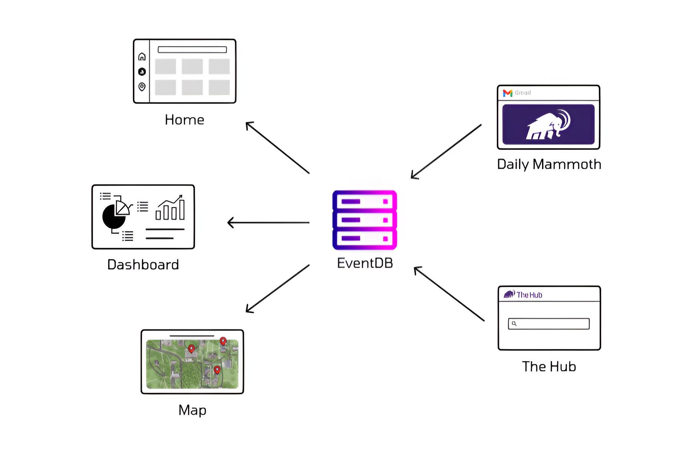
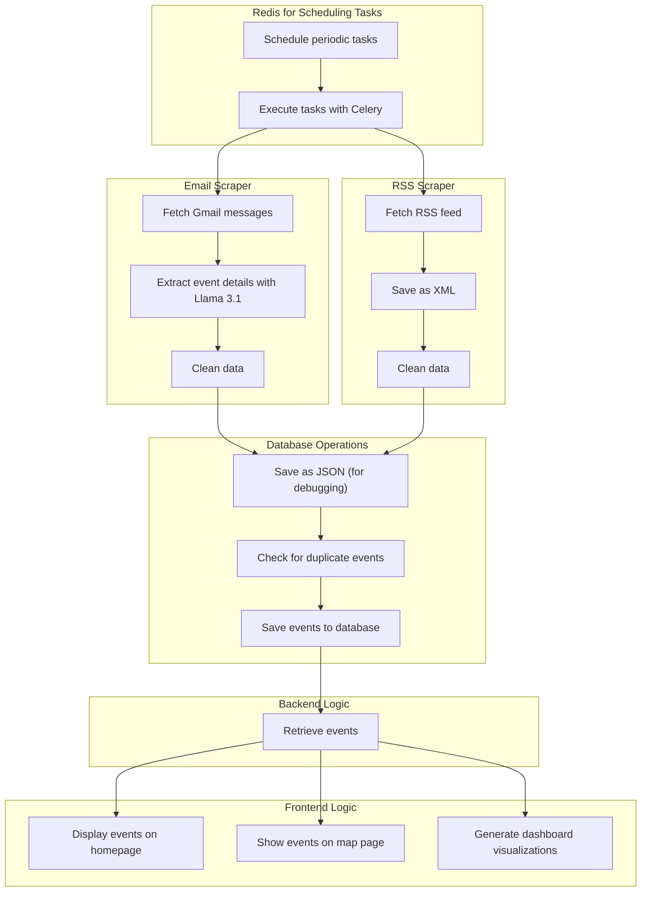

# Access Amherst - Centralized Event Hub

  [](https://coveralls.io/github/ac-i2i-engineering/access-amherst) [](https://github.com/psf/black)

Access Amherst is a web application created to connect Amherst College students through organized, accessible, and diverse event updates on campus. The platform provides real-time information on campus events, allowing students to plan their schedules effectively. 

## Key Features
- **Organized Event Updates:** Receive updates on the latest campus events in a streamlined format.
- **Interactive Event Map:** View real-time events displayed on campus buildings.
- **Comprehensive Event Calendar:** Get a big-picture view of upcoming events to manage your time effectively.
- **Additional Features:** Many more features to enhance campus engagement.

## Getting Started

To clone and set up the application locally, follow the instructions below.

### Clone the Repository

```bash
git clone https://github.com/ac-i2i-engineering/access-amherst.git
cd access-amherst
```

### Set Up a Virtual Environment

Create and activate a virtual environment to manage dependencies locally.

```bash
python3 -m venv env
source env/bin/activate
```

### Install Dependencies

```bash
pip install -r requirements.txt
```

### Run Database Migrations

Navigate to the backend directory and apply migrations to set up the database schema.

```bash
cd access_amherst_backend
python manage.py makemigrations
python manage.py migrate
```

### Start the Development Server

To run the application locally, use the following command:

```bash
python manage.py runserver
```

Visit `http://127.0.0.1:8000/` in your browser to view the application.

## System Architecture & Design

Access Amherst is designed with a modular, scalable architecture. Below is a high-level architecture diagram illustrating the core components and their interactions.



### Architecture Components

- **EventDB**: The central database storing event information accessible to multiple front-end modules.
- **Home**: Displays the latest events and announcements.
- **Dashboard**: Provides analytical insights into campus events.
- **Map**: A geographic interface to see real-time event locations on campus.
- **Daily Mammoth**: An integration with the campus email system for event notifications.
- **The Hub**: Search and discovery interface for all campus events.

### Functional Design

The following diagram provides a detailed breakdown of the application’s internal components and workflows.



## Contributing

We welcome contributions to improve Access Amherst. Please follow these guidelines:

1. **Code Formatting**: Ensure your code adheres to the `black` style guidelines. You can format your code by running:
   ```bash
   python -m black ./
   ```
   A pre-commit hook is set up to enforce this format.

2. **Documentation**: For adding or updating documentation, please refer to the [Access Amherst Backend Documentation Guide](./docs/) in `docs/`. It includes instructions on using Sphinx to document models and views, creating `.rst` files, and previewing the documentation.

3. **Pull Requests**: Before submitting a pull request, ensure that all code is well-documented, tested, and follows our coding standards.

---

For any questions or further support, please reach out to our team.
