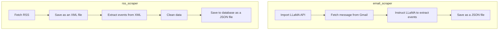

# Access Amherst (Centralized Events-Hub)

We're creating a web app to connect Amherst College students in a more convenient, intimate, and diverse way! Planned features include:
* More organized updates about events on campus
* An events map to see what's happening in real-time, with events displayed on buildings
* A calendar to see the big picture of what's to come and how to manage your time
* And much, much more!

To clone the app, run in terminal:

```bash
git clone https://github.com/ac-i2i-engineering/access-amherst.git
cd access-amherst
```

Set-up a virtual environment and activate it to "containerize" the dependencies:

```bash
python3 -m venv env
source env/bin/activate
```

To run the app locally, run:

```bash
pip install -r requirements.txt
cd access_amherst_backend
python manage.py makemigrations
python manage.py migrate
python manage.py runserver
```

## System Architecture & Design

Below, we present a high-level diagram of our architecture.


We also detail the detailed set of functionality along with their hierarchy in the mermaid diagram below:




## CONTRIBUTING

Before committing your code / raising a PR, please consider running `python -m black ./` to make sure the code format is consistent across the repository agreeing with the `black`-style production coding guidelines! We have set-up a pre-commit hook, which checks for this before allowing one to commit!

